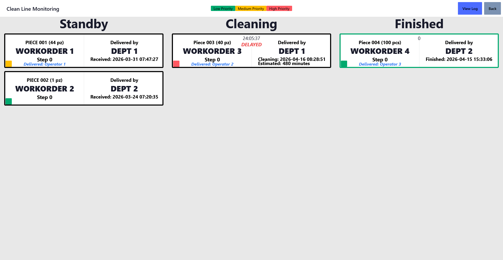

# Production Live Status

Real-time work orders status app for multiple manufacturing departments, this project was born out of the need to track product manufacturing times and replace physical whiteboards

## Technical Specifications

- Server-Sent Events
- Astro Framework
- Preact
- TailwindCSS + DaisyUI
- PostgreSQL + Prisma
- nginx

## Core Functions

- User friendly work order form
- Standby work order priority assignment
- Status update for technicians
- Real-time visualization dashboard
- Information exporting as CSV

## Running the App

1. Clone the repo with

   `git clone github.com/CabraLuis/productionStatus`

2. Run the development server

   `npm run dev`

3. Build the app

   `npm run build`

4. Start the production app

   `npm run start`

## App Routes — CMM/Clean Line

- **localhost:4321/prodOps — Operators Form**
  - Form accesible by all production operators to track their delivered work orders

- **localhost:4321/[cmm/cleanLine] — Live Dashboard**
  - **/live:** Live dashboard visible for everyone in the company
  - **/board:** Techninicans dashboard to update work orders status
  - **/prodSup:** Production supervisor dashboard to update standby work orders priorities
  - **/registry:** Information table with filtering, pagination and CSV exporting

## To Do

- Refactor modules and API to ensure easy scalibility
- Clean unused code
- Automatic app recovery if power or connection is lost
- Database backups to cloud
- Improve authentication/authorization, it was made in a rush
